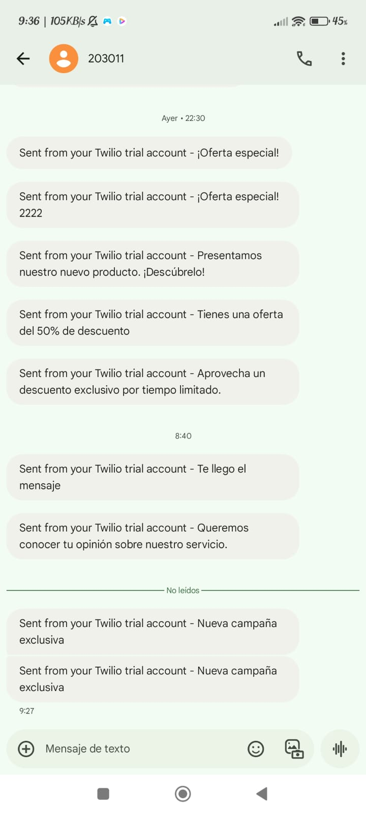

# Proyecto Backend con NestJS y Serverless Framework

Este documento describe los pasos necesarios para instalar y ejecutar el proyecto backend basado en NestJS y Serverless Framework en un entorno local.

## Requisitos previos

Antes de comenzar, asegúrate de tener instalado lo siguiente en tu máquina:

- [Node.js](https://nodejs.org/) (versión recomendada: LTS)
- [npm](https://www.npmjs.com/) (gestor de paquetes de Node.js)
- [Serverless Framework](https://www.serverless.com/framework/docs/getting-started)

## Instalación

Sigue los siguientes pasos para instalar y ejecutar el proyecto:

1. **Clonar el repositorio:**

   ```sh
   git clone <URL_DEL_REPOSITORIO>
   cd <NOMBRE_DEL_PROYECTO>
   ```

2. **Instalar dependencias del proyecto:**

   ```sh
   npm i --legacy-peer-deps
   ```

3. **Instalar Serverless Framework de manera global:**

   ```sh
   npm install -g serverless
   ```

4. **Configurar variables de entorno:**
   Crea un archivo `.env` en la raíz del proyecto con el siguiente contenido:

   ```sh
   TWILIO_ACCOUNT_SID=your_twilio_account_sid
   TWILIO_AUTH_TOKEN=your_twilio_auth_token
   TWILIO_PHONE_NUMBER=your_twilio_phone_number

   DB_HOST=your_database_host
   DB_PORT=3306
   DB_USER=your_database_user
   DB_PASSWORD=your_database_password
   DB_NAME=your_database_name
   ```

   🔴 **Nota:** No compartas credenciales reales en un repositorio público. Usa archivos de entorno o servicios de gestión de secretos.

   📌 **Importante:** Este proyecto utiliza el servicio de Twilio para el envío de mensajes SMS. Actualmente, Twilio solo enviará mensajes de manera exitosa al número registrado `+51910552498`. Los mensajes a otros números no serán entregados y su estado aparecerá como error.

5. **Construir el proyecto:**

   ```sh
   npm run build
   ```

6. **Ejecutar el proyecto en modo offline:**

   ```sh
   serverless offline
   ```

   Luego, abre en tu navegador `http://localhost:3000/api/swagger` para acceder a la documentación de Swagger y probar las APIs.

## Despliegue en Producción

Para desplegar el proyecto en AWS u otro proveedor, ejecuta:

```sh
serverless deploy
```

✅ **URL de despliegue en producción:** [Swagger API](https://fd294k2ag1.execute-api.us-east-1.amazonaws.com/api/swagger)

## Prueba de Envío de Mensajes

A continuación, se muestra una captura de pantalla de una prueba exitosa de envío de mensaje mediante Twilio:


